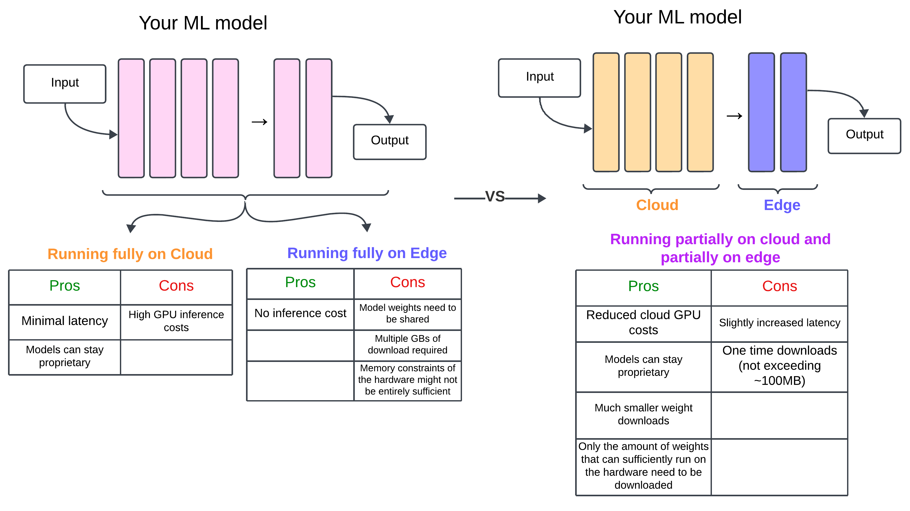
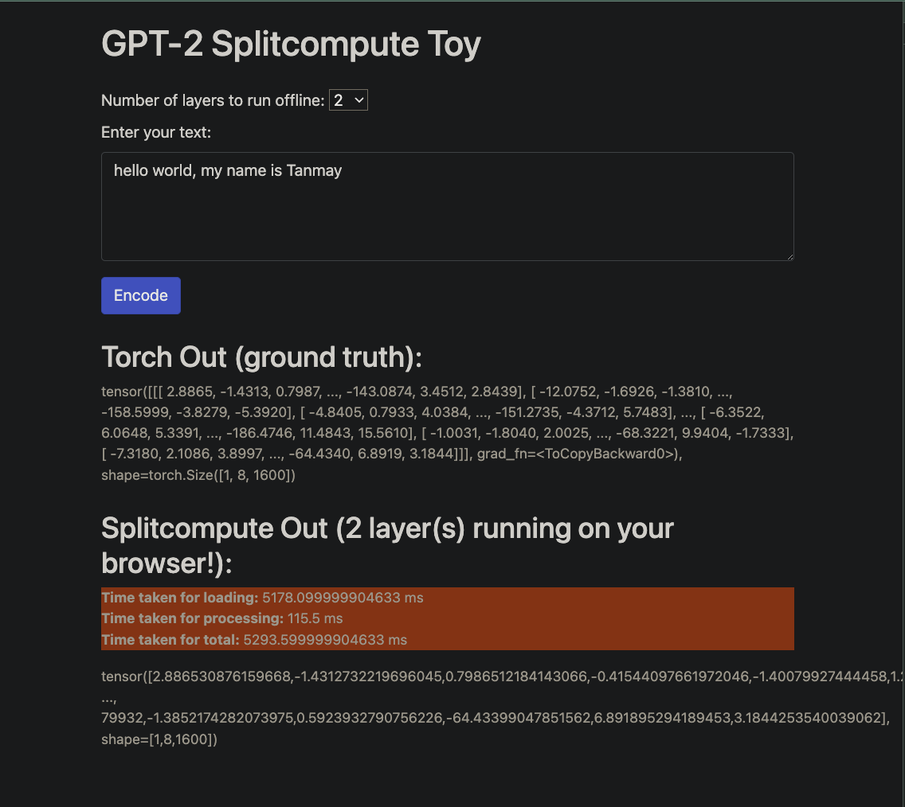

# SplitCompute [POC]

Extension of @praeclarum's work on webgpu-torch, to provide functionality
for running partial models on the Edge (and rest on the cloud).

Currently the sample-website includes code for execution of GPT-2,
and takes as input a partially executed state of the model.

### Why?

A lot of cloud compute can be handed off to edge devices, given how strong they
can be today. This can be useful in reducing GPU inference costs.

Handing off all the compute is hard because weights are heavy to transport,
but this project aims to bridge the gap by only transferring a subset of the weights.

Example: For GPT2-XL, a 1.5B model, we can transfer the last 1-2 layers amounting to less than
100 MB in disk space, which can then be processed on the edge, freeing up the cloud GPU.
At scale, this effect can likely compound.

### How?

Models such as GPT/Bert are a bunch of stacked layers. We divide a contiguous subset of these layers
between the edge and the cloud. The output of the cloud is sent as an API response, which is then
processed by the edge.

### Limitations

Can't perform autoregressive decoding yet. Useful for generating embeddings.

### Demo

Run with `python server.py` (might need to adjust BACKEND_URL in `static/gpt.js` to refer to the running server URL)

