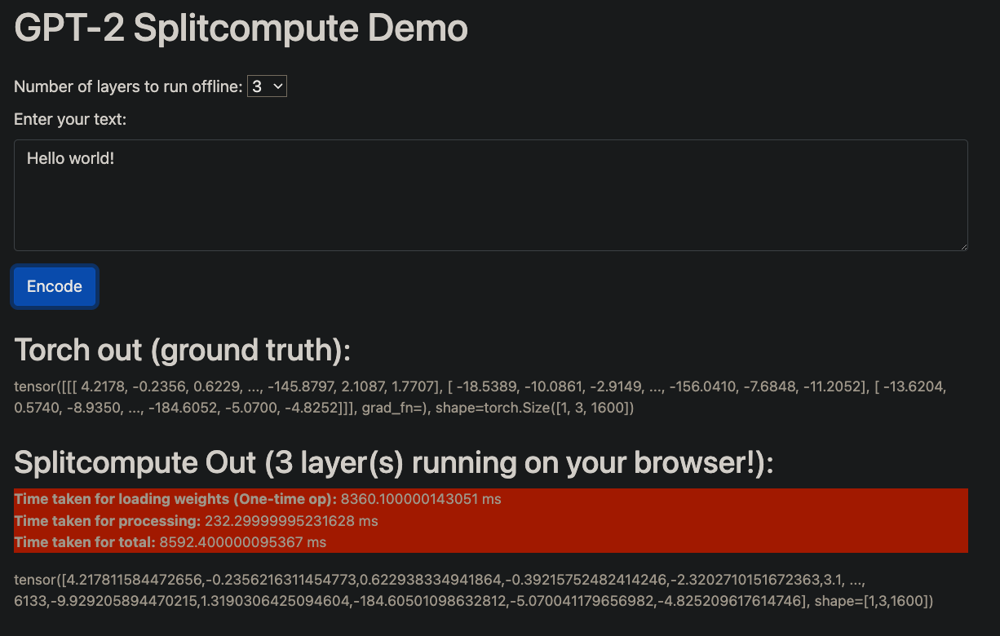

# SplitCompute


Provides functionality for running partial models on the Edge (and rest on the cloud).
Makes use of WebGPU, support on browsers is varying (Chrome is best).

Work in progress.

### What?

SplitCompute is a project to explore potential cost savings by splitting model execution at inference between
devices. Part of the inference is run on the cloud, and part of it is run **in-browser** using WebGPU.

Essentially trying to build a **load balancer that acts at the level of individual model layers**.

The current code allows a user to execute a GPT-2 model (for embedding generation) by offloading a
subset of the model's layers to the client's browser.

### Why?

A lot of cloud compute can be handed off to edge devices, given how performant they
can be today. This can be useful in reducing GPU inference costs.

Projects like [WebLLM](https://github.com/mlc-ai/web-llm) allow for running models directly on the browser,
but handing off all the compute is hard because weights are heavy to transport (order of ~10s of GBs). Moreover, the end device might have insufficient
requirements to run the model. This project aims to bridge the gap by only transferring a subset of the weights.

Example: For GPT2-XL, a 1.5B model, we can transfer the last 1-2 layers amounting to less than
100 MB in disk space, which can then be processed on the edge, freeing up the cloud GPU.

**At scale, this effect can likely compound.** Devices can be dynamically offloaded weights based on their
configurations, and since the process is fully asynchronous and non-blocking, **it can be done in real-time with
no difference in user experience.**

### How?

Models such as GPT/Bert are a bunch of stacked layers. We divide a contiguous subset of these layers
between the edge and the cloud. The output of the cloud is sent as an API response, which is then
processed by the edge.

Code makes heavy usage of @praeclarum's WIP library [WebGPU-Torch](https://github.com/praeclarum/webgpu-torch),
which has been extended to support GPT-2 (and other upcoming models).

### Limitations

Can't perform autoregressive decoding yet. Useful for generating embeddings.

### Benchmarks

| Laptop     | Inference Time (time/layer) | Loading Weights (one-time time/layer) | Model |
| ---------- | ------ | ---------------------- | ------ |
| MBP M1-Pro | ~60ms | ~2700ms | GPT-2 XL |

(TODO: More datapoints, upcoming M1-Air, more models - BERT)

### Guide

Splitcompute works by having a model's implementation in python for the backend and in javascript for the frontend.
For GPT-2, the model is implemented in `gpt2_model.py` for backend execution and in `static/gpt.js` for frontend execution.

1. The `webgpu-torch` directory contains the library orchestrating the tensor compute on the browser. It is built using typescript,
and containes a compiler to convert tensor operations to WebGPU shaders.  

To build `webgpu-torch`, and copy it over to the frontend for flask to serve, run:
(**This is not necessary if you just want to test**, as the built library is already included at `static/torch.js`)

```bash
cd webgpu-torch
npx webpack
cp dist/torch.js ../static/
```

2. The `server.py` file contains the Flask server which acts as a dummy backend, and provides routes for supplying weights.

```bash
pip install -r requirements.txt

# Might need to adjust the BACKEND_URL in static/model_loading_utils.js to refer to the running server URL
python server.py
```

3. The `gpt2_utils.py` file contains the code to load the GPT-2 model weights by copying them over from huggingface.
It contains functionality to partially execute and dump model state, which can then be forwarded to the edge.

4. The `static` folder contains the model file `gpt.js` that describes how computations happen inside GPT-2, and uses
the `webgpu-torch` library to perform the computations. It is also responsible for the API calls to load the weights.

### Demo

Run with `python server.py` (might need to adjust `BACKEND_URL` in `static/model_loading_utils.js` to refer to the running server URL)




Check out the video demo as well, built for buildspace nights and weekends: [](https://www.youtube.com/watch?v=F-NzOAjeG4M)

### Future Work

Add more models, benchmark on more devices.
A lot of work pending on webgpu-torch to support more tensor ops.

### Contributing

This repo is quite immature, and would benefit a lot from contributions. Feel free to open issues, PRs, or reach out to me directly.

* To add new models -  
New models can be added by implementing the respective classes in python and JS, the GPT2 classes can be used for reference.
Since this is essentially a frontend project, the JS part goes into the `static` folder for easy testing with flask.
To include more JS files, update the `templates/index.html` file.
